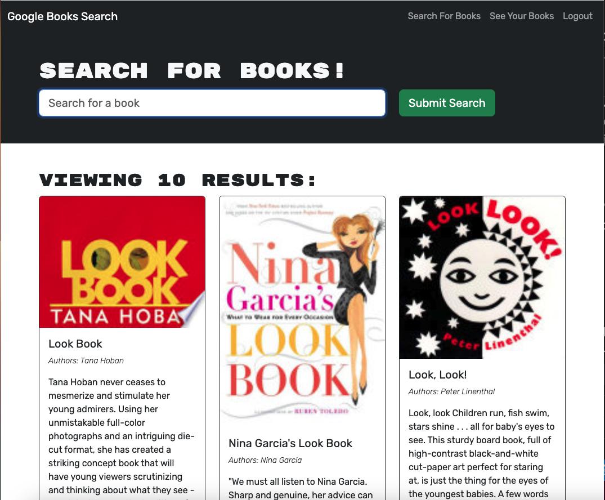

# Mern-bookEngine-drawlin22

# Description
This project was to take an existing application that uses restful API's and convert it to using graphql API. The application allows users to sign up/log in. Once signed in a user is able to search for books and save books to their books page. Previously saved books can be removed from user book page.

# Table of Contents
- [Installation](#installation)
- [Usage](#usage)
- [License](#license)
- [Credits](#credits)

# Installation

To install clone the repository. Run Node command npm i to install dependencies. Run npm start to initiate the server. 

# Usage

Link to deployed application: https://mern-books-drawlin22-a0868dbc6371.herokuapp.com/

# License
MIT

# Credits
Peer Colaboration:

Chelsea Wagner: https://github.com/caf62219
Kyle Jocoy: https://github.com/Kylyote/
Colton Firestone:https://github.com/ColtonMakesStuff
Nedda Elsayed: https://github.com/Lven-Nemsy

Additional Resources:

Phind.com

askBCS learning assistants Mia, Joem, Shane